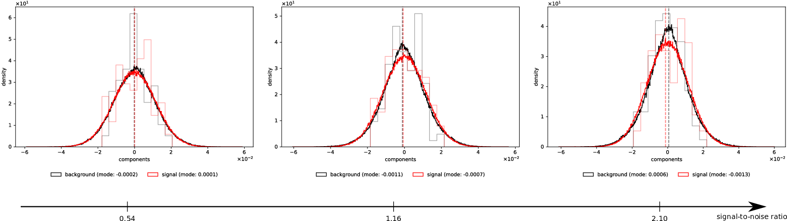

# Multi-noise Components and Finite Size Effects in Nearly Continuous Spectra

- **Riccardo Finotello** - Université Paris Saclay, CEA, *Service de Génie Logiciel et de Simulation* (SGLS), Gif-sur-Yvette, F-91191, France
- **Vincent Lahoche** - Université Paris Saclay, CEA, LIST, Palaiseau, F-91120, France
- **Dine Ousmane Samary** - Université Paris Saclay, CEA, LIST, Palaiseau, F-91120, France

## Abstract



Signal detection is one of the main challenges of data science, as noise corruption may corrupt measurements and hinder the discovery of significant pieces of data.
A wide range of techniques aimed at extracting the relevant degrees of freedom from data has been developed over the years.
However, some issues remain difficult.
It is notably the case of signal detection in almost continuous spectra, when the signal-to-noise ratio is small enough.
Following recent advancements, we propose to tackle this issue by analysing the properties of the underlying field theory arising as a kind of maximal entropy distribution close to the boundary of the spectrum.
Nearly continuous spectra provide an intrinsic scaling law for field and couplings, depending on the energy scale.
The enable constructing a non-conventional renormalization group which progressively integrates degrees of freedom of the spectrum.
In this paper we provide an analysis of the properties of this renormalization group in the Gaussian regime and beyond.
We also propose a method for estimating the number of noise components and define a limit of detection in a general nearly continuous spectrum using the renormalization group.

## Requirements

The framework has been developed under _Python_ 3.12.7.
You can install the required packages using the following command:

```bash
pip install -r requirements.txt
```

## Contributing

Take a look at the [CONTRIBUTING](CONTRIBUTING.md) file for more information.

## Documentation

In order to compile the documentation, you need to install the `sphinx` package, and its theme `sphinx_rtd_theme`:

```bash
pip install sphinx sphinx_rtd_theme
```

Then, you can compile it by running:

```bash
cd docs
make html
```

The documentation will be available in the `docs/_build/html` folder.
Simply open the `index.html` file in your browser to see it.

## Configuration Files

Tasks are entirely defined by configuration files (usually stored in the [`config`](./config) folder), based on the [YACS](https://github.com/rbgirshick/yacs) library.
These are simple `.yaml` files, and can be easily edited using a text editor.

The default configuration is

```yaml
DATA:
  OUTPUT_DIR: results
DIST:
  NUM_SAMPLES: 1000
  RATIO: 0.5
  SEED: 42
  SIGMA: 1.0
PLOTS:
  OUTPUT_DIR: plots
POT:
  UV_SCALE: 1.0e-05
  KAPPA_INIT: 1.0e-09
  U2_INIT: 1.0e-05
  U4_INIT: 1.0e-05
  U6_INIT: 0.0
SIG:
  INPUT: "/path/to/image-or-covariance-matrix"
  SNR: 0.0
```

Allowed entries are:

- `DATA.OUTPUT_DIR`: directory where the results will be stored,
- `DIST.NUM_SAMPLES`: size of the data sample to use,
- `DIST.RATIO`: ratio between the number of variables (degrees of freedom, or columns of the data matrix) and the sample size (rows of the data matrix),
- `DIST.SEED`: random seed to use,
- `DIST.SIGMA`: standard deviation of the distribution,
- `PLOTS.OUTPUT_DIR`: directory where the plots will be stored,
- `POT.UV_SCALE`: high energy scale at which to start the computations,
- `POT.KAPPA_INIT`: initial value for the location of the zero of the potential,
- `POT.U2_INIT`: initial value for the mass (quadratic) coupling,
- `POT.U4_INIT`: initial value for the quartic coupling,
- `POT.U6_INIT`: initial value for the sextic coupling,
- `SIG.INPUT`: path to the input signal or covariance matrix,
- `SIG.SNR`: signal-to-noise ratio (the signal will be scaled by this factor).

## Usage

While most of the code is contained in the `frg` package (see the [`src`](./src) folder), several scripts are available for different tasks in the `scripts` folder.

> **NOTE**
> The full list of options and arguments allowed by the scripts can be retrieved by running the script with the `--help` argument from the command line.

## Generation of Multiple Configuration Files

Starting from a base configuration file, multiple derived configurations can be automatically generated using the `generate_config.py` script:

```bash
./scripts/generate_config.py \
    --config /path/to/base_config.yaml \
    --params /path/to/parameters.json \
    --n_samples <number_of_files_to_generate> \
    --output_dir /path/to/output_directory \
    --seed <random_seed>
```

New points are generated using random sampling of the parameter space, using a _Latin Hypercube Sampling_ (LHS) algorithm.

The JSON file containing the parameters to sample must be formatted using the configuration keys as keys (case-insensitive) of the dictionary.
Values can then be input as lists containing the minimum value and maximum value.
For instance:

```json
{
    "pot": {
        "u2_init": [-1e-05, 1e-05],
        "u4_init": [-1e-05, 1e-05],
        "u6_init": [-1e-05, 1e-05]
    }
}
```

will act on the parameters `POT.U2_INIT`, `POT.U4_INIT` and `POT.U6_INIT` in the configuration files.

> **NOTE**
> You can use the option `--plots` to visualise the sampled points in the parameter space.

### Computation of the Canonical Dimensions

The file `canonical_dimensions.py` can be used to compute the canonical dimensions of the distribution of singular values:

```bash
./scripts/canonical_dimensions.py \
    --config /path/to/config.yaml
```

> **NOTE**
> The `--analytic` argument can be used to run an analytic simulation instead of a numerical one.

### Computation of the Functional Renormalization Group Equations

The file `frg_equations.py` can be used to compute the functional renormalization group equations:

```bash
./scripts/frg_equations.py \
    --config /path/to/config.yaml
```

> **NOTE**
> The `--analytic` argument can be used to run an analytic simulation instead of a numerical one.

### Computation of the Functional Renormalization Group Equations in Local Potential Approximation

The file `frg_equations_lpa.py` can be used to compute the functional renormalization group equations in the Local Potential Approximation (LPA):

```bash
./scripts/frg_equations_lpa.py \
    --config /path/to/config.yaml
```

> **NOTE**
> The `--analytic` argument can be used to run an analytic simulation instead of a numerical one.

### Plotting the Canonical Dimensions

The file `plot_canonical_dimensions.py` can be used to plot the canonical dimensions of the distribution of singular values:

```bash
./scripts/plot_canonical_dimensions.py \
    /path/to/data.json
    --output /path/to/output.png
```

In this case, the JSON file has been produced by the `canonical_dimensions.py` script.

The file `plot_canonical_dimensions_snr.py` can be used to plot the canonical dimensions of the distribution of singular values as a function of the signal-to-noise ratio.
In this case, multiple JSON files need to be provided:

```bash
./scripts/plot_canonical_dimensions_snr.py \
    /path/to/data1.json \
    /path/to/data2.json \
    /path/to/data3.json \
    ... \
    --scale <momentum_scale> \
    --output /path/to/output.png
```

The momentum scale represents the value of the momentum at which the canonical dimension is computed.

### Plotting the Functional Renormalization Group Equations

Different scripts (starting with `plot_frg_equations_*`) have been prepared for different types of plots:

1. **trajectories**: the `*_traj.py` scripts provide a plot of the trajectories of the parameters from UV to IR,
2. **phase space**: the `*_space.py` scripts provide a plot of the phase space of the FRG flow (i.e. points which ended in a symmetric or broken phase in the IR),
3. **signal-to-noise ratio**: the `*_snr.py` scripts provide a plot of _size_ of the symmetric and broken phase regions as a function of the signal-to-noise ratio.

In all cases, scripts must be called as follows:

```bash
./scripts/plot_frg_equations.py \
    /path/to/data1.json \
    /path/to/data2.json \
    /path/to/data3.json \
    ... \
    --output /path/to/output.png
```

where each JSON file contains the results of a numerical simulation for different initial conditions (i.e. each file has been produced by the `frg_equations.py` or `frg_equations_lpa.py` script).
