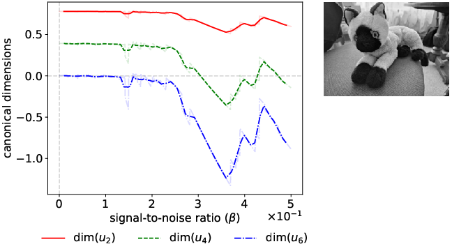

# Functional Renormalization for Signal Detection

## Dimensional analysis and dimensional phase transition for nearly continuous spectra effective field theory

- **Riccardo Finotello** - Université Paris Saclay, CEA, *Service de Génie Logiciel et de Simulation* (SGLS), Gif-sur-Yvette, F-91191, France
- **Vincent Lahoche** - Université Paris Saclay, CEA, Palaiseau, F-91120, France
- **Dine Ousmane Samary** - Faculté des Sciences et Techniques (ICMPA-UNESCO Chair), Université d’Abomey-Calavi, 072 BP 50, Benin


[](https://arxiv.org/abs/2507.01064)
[](https://github.com/thesfinox/frg-signal-detection)
[](https://frg-signal-detection.readthedocs.io/en/latest/)

## Abstract



Signal detection is one of the main challenges of data science.
According to the nature of the data, the presence of noise may corrupt measurements and hinder the discovery of significant patterns.
A wide range of techniques aiming at extracting the relevant degrees of freedom from data has been thus developed over the years.
However, signal detection in almost continuous spectra, when the signal-to-noise ratio is small, remains a known difficult issue.
This paper develops over recent advancements proposing to tackle this issue by analysing the properties of the underlying effective field theory arising as a kind of maximal entropy distribution in the vicinity of universal random matrix distributions.
Nearly continuous spectra provide an intrinsic and non-conventional scaling law for field and couplings, the scaling dimensions depending on the energy scale.
The related coarse-graining over small eigenvalues of the empirical spectrum defines a specific renormalization group, whose characteristics change when the collective behaviour of “informational” modes become significant, that is, stronger than the intrinsic fluctuations of noise.
This paper pursues three different goals.
First, we propose to quantify the real effects of fluctuations relative to what can be called “signal”, while improving the robustness of the results obtained in our previous work.
Second, we show that quantitative changes in the presence of a signal result in a counterintuitive modification of the distribution of eigenvectors.
Finally, we propose a method for estimating the number of noise components and define a limit of detection in a general nearly continuous spectrum using the renormalization group.
The main statements of this paper are essentially numeric, and their reproducibility can be checked using the associated code.

## Requirements

The framework has been developed under _Python_ 3.12.7.
You can install the required packages using the following command:

```bash
pip install -r requirements.txt
```

## Contributing

Take a look at the [CONTRIBUTING](CONTRIBUTING.md) file for more information.

## Documentation

In order to compile the documentation, you need to install the `sphinx` package, and its theme `sphinx_rtd_theme`:

```bash
pip install sphinx sphinx_rtd_theme
```

Then, you can compile it by running:

```bash
cd docs
make html
```

The documentation will be available in the `docs/_build/html` folder.
Simply open the `index.html` file in your browser to see it.

## Configuration Files

Tasks are entirely defined by configuration files (usually stored in the [`config`](./config) folder), based on the [YACS](https://github.com/rbgirshick/yacs) library.
These are simple `.yaml` files, and can be easily edited using a text editor.

The default configuration is

```yaml
DATA:
  OUTPUT_DIR: results
DIST:
  NUM_SAMPLES: 1000
  RATIO: 0.5
  SEED: 42
  SIGMA: 1.0
PLOTS:
  OUTPUT_DIR: plots
POT:
  UV_SCALE: 1.0e-05
  KAPPA_INIT: 1.0e-09
  U2_INIT: 1.0e-05
  U4_INIT: 1.0e-05
  U6_INIT: 0.0
  UV_SCALE: 0.7
SIG:
  INPUT: "/path/to/image-or-covariance-matrix"
  SNR: 0.0
```

Allowed entries are:

- `DATA.OUTPUT_DIR`: directory where the results will be stored,
- `DIST.NUM_SAMPLES`: size of the data sample to use,
- `DIST.RATIO`: ratio between the number of variables (degrees of freedom, or columns of the data matrix) and the sample size (rows of the data matrix),
- `DIST.SEED`: random seed to use,
- `DIST.SIGMA`: standard deviation of the distribution,
- `PLOTS.OUTPUT_DIR`: directory where the plots will be stored,
- `POT.UV_SCALE`: high energy scale at which to start the computations,
- `POT.KAPPA_INIT`: initial value for the location of the zero of the potential,
- `POT.U2_INIT`: initial value for the mass (quadratic) coupling,
- `POT.U4_INIT`: initial value for the quartic coupling,
- `POT.U6_INIT`: initial value for the sextic coupling,
- `POT.UV_SCALE`: UV high energy scale,
- `SIG.INPUT`: path to the input signal or covariance matrix,
- `SIG.SNR`: signal-to-noise ratio (the signal will be scaled by this factor).

## Usage

While most of the code is contained in the `frg` package (see the [`src`](./src) folder), several scripts are available for different tasks in the `scripts` folder.

> **NOTE**
> The full list of options and arguments allowed by the scripts can be retrieved by running the script with the `--help` argument from the command line.

## Generation of Multiple Configuration Files

Starting from a base configuration file, multiple derived configurations can be automatically generated using the `generate_config.py` script:

```bash
./scripts/generate_config.py \
    --config /path/to/base_config.yaml \
    --params /path/to/parameters.json \
    --n_samples <number_of_files_to_generate> \
    --output_dir /path/to/output_directory \
    --seed <random_seed>
```

New points are generated using random sampling of the parameter space, using a _Latin Hypercube Sampling_ (LHS) algorithm.

The JSON file containing the parameters to sample must be formatted using the configuration keys as keys (case-insensitive) of the dictionary.
Values can then be input as lists containing the minimum value and maximum value.
For instance:

```json
{
    "pot": {
        "u2_init": [-1e-05, 1e-05],
        "u4_init": [-1e-05, 1e-05],
        "u6_init": [-1e-05, 1e-05]
    }
}
```

will act on the parameters `POT.U2_INIT`, `POT.U4_INIT` and `POT.U6_INIT` in the configuration files.

> **NOTE**
> You can use the option `--plots` to visualise the sampled points in the parameter space.

### Computation of the Canonical Dimensions

The file `canonical_dimensions.py` can be used to compute the canonical dimensions of the distribution of singular values:

```bash
./scripts/canonical_dimensions.py \
    --config /path/to/config.yaml
```

> **NOTE**
> The `--analytic` argument can be used to run an analytic simulation instead of a numerical one.

### Computation of the Functional Renormalization Group Equations

The file `frg_equations.py` can be used to compute the functional renormalization group equations:

```bash
./scripts/frg_equations.py \
    --config /path/to/config.yaml
```

> **NOTE**
> The `--analytic` argument can be used to run an analytic simulation instead of a numerical one.

### Computation of the Functional Renormalization Group Equations in Local Potential Approximation

The file `frg_equations_lpa.py` can be used to compute the functional renormalization group equations in the Local Potential Approximation (LPA) with an expansion around a non trivial vacuum:

```bash
./scripts/frg_equations_lpa.py \
    --config /path/to/config.yaml
```

> **NOTE**
> The `--analytic` argument can be used to run an analytic simulation instead of a numerical one.

### Analysis of the Eigenvector Components

The script `evc_distribution.py` computes the distribution of the eigenvectors of the correlations:

```bash
./scripts/evc_distribution.py \
    --config /path/to/config.yaml
```
