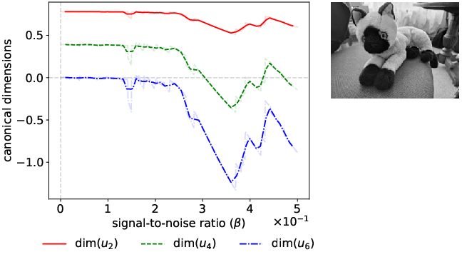

# Functional Renormalization for Signal and Anomaly Detection

- **Riccardo Finotello** - Université Paris Saclay, CEA, *Service de Génie Logiciel et de Simulation* (SGLS), Gif-sur-Yvette, F-91191, France
- **Parham Radpay** - Université Paris Saclay, CEA, Palaiseau, F-91120, France
- **Vincent Lahoche** - Université Paris Saclay, CEA, Palaiseau, F-91120, France
- **Dine Ousmane Samary** - Faculté des Sciences et Techniques (ICMPA-UNESCO Chair), Université d’Abomey-Calavi, 072 BP 50, Benin

[](https://arxiv.org/abs/2507.01064)
[](https://arxiv.org/abs/YYMM.YYYYY)
[](https://github.com/thesfinox/frg-signal-detection)
[](https://frg-signal-detection.readthedocs.io/en/latest/)



## Requirements

The framework has been developed under *Python* 3.12.7.
It is recommended to use [uv](https://github.com/astral-sh/uv) for package management.

### Production Version

You can directly install the package using `uv`:

```bash
uv tool install git+https://github.com/thesfinox/frg-signal-detection.git
```

### Development Version

To develop the package, you can clone the repository and sync the environment:

```bash
git clone https://github.com/thesfinox/frg-signal-detection.git
cd frg-signal-detection
uv sync
```

To install the dependencies for documentation or testing, you can use the optional groups:

```bash
uv sync --group docs
uv sync --group tests
```

## Contributing

Take a look at the [CONTRIBUTING](CONTRIBUTING.md) file for more information.

## Documentation

To compile the documentation, you can use `uv` to install the dependencies and run the build process:

```bash
uv run --group docs make -C docs html
```

The documentation will be available in the `docs/build/html` folder.
Simply open the `index.html` file in your browser to see it.

## Configuration Files

Tasks are entirely defined by configuration files (usually stored in the [`config`](./config) folder), based on the [YACS](https://github.com/rbgirshick/yacs) library.
These are simple `.yaml` files, and can be easily edited using a text editor.

The default configuration is

```yaml
DATA:
  OUTPUT_DIR: results
DIST:
  NUM_SAMPLES: 1000
  RATIO: 0.5
  SEED: 42
  VAR: 1.0
  IS_POIS: false
  POIS_DATA: false
  POIS_LAM: 10.0
  POIS_MODE: centered
POT:
  KAPPA_INIT: 1.0e-05
  U2_INIT: 1.0e-05
  U4_INIT: 1.0e-05
  U6_INIT: 1.0e-05
  UV_SCALE: 1.0e-05
SIG:
  INPUT: null
  SNR: 0.0
```

Allowed entries are:

- `DATA.OUTPUT_DIR`: directory where the results will be stored,
- `DIST.NUM_SAMPLES`: size of the data sample to use,
- `DIST.RATIO`: ratio between the number of variables (degrees of freedom, or columns of the data matrix) and the sample size (rows of the data matrix),
- `DIST.SEED`: random seed to use,
- `DIST.VAR`: variance of the distribution (previously `SIGMA`),
- `DIST.IS_POIS`: boolean flag to enable Poisson noise injection,
- `DIST.POIS_DATA`: if `True`, Poisson noise is added directly to the data (overwriting the Gaussian component). If `False`, it is added to the covariance matrix,
- `DIST.POIS_LAM`: lambda parameter for the Poisson distribution,
- `DIST.POIS_MODE`: centering mode for Poisson noise (`centered`, `non-centered`, or `mirrored`),
- `POT.KAPPA_INIT`: initial value for the location of the zero of the potential,
- `POT.U2_INIT`: initial value for the mass (quadratic) coupling,
- `POT.U4_INIT`: initial value for the quartic coupling,
- `POT.U6_INIT`: initial value for the sextic coupling,
- `POT.UV_SCALE`: UV high energy scale,
- `SIG.INPUT`: path to the input signal or covariance matrix,
- `SIG.SNR`: signal-to-noise ratio (the signal will be scaled by this factor). Setting `SNR < 0` discards noise.

## Noise Injection Use Cases

The framework supports four primary noise modelling scenarios controlled via configuration:

1. **Signal + Gaussian Noise**: Set `DIST.IS_POIS: false` and `SIG.SNR >= 0`. Noise is added directly to the data.
2. **Signal + Poisson Noise**: Set `DIST.IS_POIS: true`, `DIST.POIS_DATA: true`, and `SIG.SNR >= 0`. Poisson noise completely overwrites the Gaussian background.
3. **Mixed Noise (Gaussian + Poisson)**: Set `DIST.IS_POIS: true`, `DIST.POIS_DATA: false`, and `SIG.SNR >= 0`. Gaussian noise is added to the signal, while Poisson noise is injected into the covariance matrix.
4. **Pure Signal**: Set `SIG.SNR < -1.0` (or any negative value) to discard the noise component entirely.

## Usage

If you installed the package in production mode, you first need to initialize the workspace:

```bash
frg-init
```

This will copy the default configuration files and scripts to your current directory.
You can then run the various tools using their CLI entry points.

> **NOTE**
> The full list of options and arguments allowed by the scripts can be retrieved by running the script with the `--help` argument from the command line.

## Generation of Multiple Configuration Files

Starting from a base configuration file, multiple derived configurations can be automatically generated using the `frg-generate-config` command:

```bash
frg-generate-config \
    --config /path/to/base_config.yaml \
    --params /path/to/parameters.json \
    --n_samples <number_of_files_to_generate> \
    --output_dir /path/to/output_directory \
    --seed <random_seed>
```

New points are generated using random sampling of the parameter space, using a *Latin Hypercube Sampling* (LHS) algorithm.

The JSON file containing the parameters to sample must be formatted using the configuration keys as keys (case-insensitive) of the dictionary.
Values can then be input as lists containing the minimum value and maximum value.
For instance:

```json
{
    "pot": {
        "u2_init": [-1e-05, 1e-05],
        "u4_init": [-1e-05, 1e-05],
        "u6_init": [-1e-05, 1e-05]
    }
}
```

will act on the parameters `POT.U2_INIT`, `POT.U4_INIT` and `POT.U6_INIT` in the configuration files.

> **NOTE**
> You can use the option `--plots` to visualise the sampled points in the parameter space.

### Computation of the Canonical Dimensions

The command `frg-canonical-dimensions` can be used to compute the canonical dimensions of the distribution of singular values:

```bash
frg-canonical-dimensions \
    --config /path/to/config.yaml
```

> **NOTE**
> The `--analytic` argument can be used to run an analytic simulation instead of a numerical one.

### Computation of the FRG Equations

The command `frg-equations` can be used to compute the functional renormalization group equations:

```bash
frg-equations \
    --config /path/to/config.yaml
```

> **NOTE**
> The `--analytic` argument can be used to run an analytic simulation instead of a numerical one.

### Computation of the FRG Equation in Non-trivial Vacuum

The command `frg-equations-lpa` can be used to compute the functional renormalization group equations in the Local Potential Approximation (LPA) with an expansion around a non trivial vacuum:

```bash
frg-equations-lpa \
    --config /path/to/config.yaml
```

> **NOTE**
> The `--analytic` argument can be used to run an analytic simulation instead of a numerical one.

### Analysis of the Eigenvector Components

The command `frg-evc-distribution` computes the distribution of the eigenvectors of the correlations:

```bash
frg-evc-distribution \
    --config /path/to/config.yaml
```
